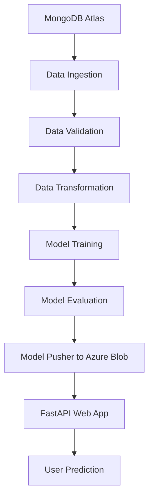

<p align="center">
  
</p>

# 🚗 Vehicle Insurance ML Project — End-to-End MLOps on Azure

Hey there! 👋
Welcome to my Vehicle Insurance Machine Learning project — where I built everything **from scratch** using core **MLOps principles** without relying on any automation tools like DVC or Prefect.

This project is my personal deep dive into how real-world machine learning systems are built, deployed, and maintained in production. I wanted to understand the **"hard parts"** of MLOps by actually doing them myself — no shortcuts.

---

## 🧠 What’s This Project About?

The goal is simple: predict whether a customer is likely to take vehicle insurance, based on their profile.

But the real focus of this project is not just the prediction. It's about building a **production-ready machine learning pipeline** that covers:

* Clean **data flow** from MongoDB Atlas
* Full **model lifecycle** (train, validate, evaluate)
* **CI/CD pipeline** with GitHub Actions
* **Deployment on Azure VM**
* **Model serving** through a web app built with **FastAPI**
* Secure **cloud storage** via Azure Blob Storage

And most importantly — I wrote everything myself, following MLOps best practices as if I were part of a real team shipping a model to production.

---

## 🔧 Key Features

* **Hardcoded, robust pipeline** (no DVC or MLflow)
* End-to-end stages:

  * ✅ Data Ingestion (from MongoDB)
  * ✅ Data Validation (with schema checks)
  * ✅ Data Transformation (scaling, encoding, cleaning)
  * ✅ Model Training & Evaluation
  * ✅ Model Pusher (uploads `model.pkl` to Azure Blob Storage)
* **Web App with FastAPI**

  * Pulls the model from Azure
  * Accepts input and displays predictions on the frontend
* **CI/CD pipeline using GitHub Actions**

  * Automatically builds, pushes Docker image to Azure Container Registry (ACR)
  * Deploys to Azure VM via SSH
* **Secrets Management**

  * Used GitHub secrets for all sensitive credentials

---

## 🌐 Technologies I Used

* **Python** (core language)
* **scikit-learn, pandas, numpy** (for ML)
* **MongoDB Atlas** (cloud database)
* **Azure Blob Storage** (to store model)
* **FastAPI** (backend for prediction service)
* **Docker** (for containerization)
* **Azure VM + ACR** (cloud hosting and container registry)
* **GitHub Actions** (CI/CD)

---

## 🛠 How It All Works

Here’s a quick overview of the pipeline:



Each step is a Python module that I wrote to follow software engineering practices like modularization, exception handling, and logging.

---

## 🚀 How to Run This Project (End-to-End)

> 🧩 **Note**: This is a real-world deployment, so you’ll need some Azure setup.

### 🔐 GitHub Secrets Required

Make sure to set the following secrets in your GitHub repository:

* `ACR_LOGIN_SERVER`
* `ACR_USERNAME`
* `ACR_PASSWORD`
* `MONGODB_URL`
* `AZURE_STORAGE_CONNECTION_STRING`
* `VM_IP`

### 🔧 Azure VM Setup

* Open ports:

  * `22` (SSH)
  * `80` (HTTP)
  * `5000` (FastAPI App)
* Add a user and assign them **Owner** or **Contributor** role

### 📦 Run Locally (Optional)

```bash
python app.py
```

This will trigger the fastAPI app.

### 🌍 Visit the App

Once deployed, go to:

```
http://<your-azure-vm-ip>:5000/
```

You’ll see the FastAPI Web app

---

## 💡 Why I Built It This Way

I could’ve used DVC, MLflow, or other tools — but I didn’t.
Why?

Because I wanted to **really understand what’s going on under the hood**. I’ve seen how ML engineers rely on tools that abstract away the pipeline, and I wanted to do the opposite.

This project helped me:

* Think like a software engineer and not just a data scientist
* Learn how CI/CD works with real cloud infrastructure
* Get hands-on with secure, modular MLOps design

It was tough at times, but it made me a stronger engineer overall.

---

## 🧑‍💼 About Me

I’m someone who loves figuring things out from the ground up.

* 🔍 I enjoy solving real problems — not just getting models to work.
* 🛠 I care about clean code, clear structure, and maintainability.
* ☁️ I’m passionate about cloud technologies and real-world deployment.
* 🤝 I value teamwork, ownership, and continuous learning.

I’m currently looking for **remote opportunities** (internship, freelance, or full-time) in **ML Engineering, MLOps, or Backend Dev**.

---

## 📬 Let’s Connect!

* **📧 Email**: [farjhanahmed@gmail.com](mailto:farjhanahmed@gmail.com)
* **🔗 LinkedIn**: [in/farjhan-ahmed](https://www.linkedin.com/in/farjhan-ahmed)
* **💻 Portfolio**: [portfolio]()

---

## 🙏 Thanks for checking out my project!

This wasn't just about building an ML model — it was about building **my confidence** and **proving to myself** that I can take an idea from data to deployment, all by myself.

If you’re hiring, mentoring, or just want to geek out about MLOps or FastAPI, I’d love to connect. 😊

---

